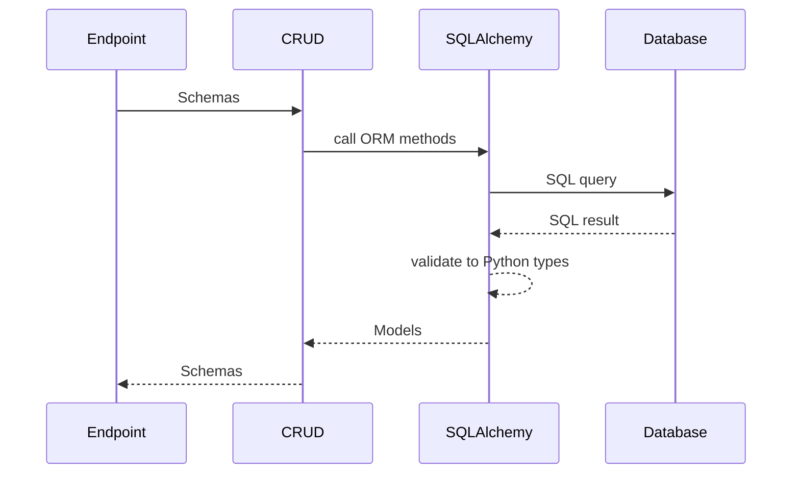

# CRUDs Guide

## Introduction

Now we can move to the last fundamental pillar of a module: the CRUDs (Create, Read, Update, Delete). The CRUDs are the functions that perform the actual operations on the database. They are defined in the `crud_{module_name}.py` file.
You should think of the CRUDs as the "data access layer" of your module. There is no "business" logic in CRUDs. Furthermore, the CRUDs are not specific to an API context, so they should be independent of the API layer. You can call the CRUDs from anywhere in your codebase, whether it's from an API endpoint, a background task, or even a script and thus they should not raise HTTP exceptions.

To say it in a word, CRUDs are the operations on the database.

## Quick visual overview

A visual overview is sometimes worth a thousand words:



## Table of 4 verbs

Now that we have already seen schemas and endpoints, let's do a quick parallel between the 4 verbs in different layers:

| HTTP verb | CRUD verb | SQL verb |
|-----------|-----------|----------|
| POST      | Create    | INSERT   |
| GET       | Read      | SELECT   |
| PATCH/PUT | Update    | UPDATE   |
| DELETE    | Delete    | DELETE   |

## CRUDs with SQLAlchemy

SQLAlchemy is the library that we use in Hyperion to interact with the database. It allows us to write Python code that generates SQL queries, and it also provides an ORM (Object-Relational Mapping) layer that allows us to work with Python objects instead of raw SQL.

We will use examples to illustrate how to perform CRUD operations with SQLAlchemy in Hyperion. In this guide we will only cover the basics, and we will see more advanced topics in next sections.

### Get = Select

Here is an example of a GET operation without filters, relations (hence the EventSimple schema).

```py
from uuid import UUID

from sqlalchemy import select
from sqlalchemy.ext.asyncio import AsyncSession

from app.modules.ticketing import models_ticketing, schemas_ticketing

async def get_events(
    db: AsyncSession,
    # For a get query there is no need for an input schema, we just need the db session to perform the query
) -> list[schemas_ticketing.EventSimple]: # The output is a list of schemas, because we want to return a list of events, and each event is represented by a schema.
    """Get all events."""
    
    events = await db.execute(select(models_ticketing.TicketingEvent))
    return [
        schemas_ticketing.EventSimple(
            id=event.id,
            organiser_id=event.organiser_id,
            creator_id=event.creator_id,
            name=event.name,
            open_date=event.open_date,
            close_date=event.close_date,
            quota=event.quota,
            user_quota=event.user_quota,
            used_quota=event.used_quota,
            disabled=event.disabled,
        ) # Conversion to schema
        for event in events.scalars().all()
        # Listing all events from the db
    ]
```

So explanation of SQLAlchemy query:

```py
select(models_ticketing.TicketingEvent)
```
is the SQLAlchemy way to say
```sql
SELECT * FROM ticketing_event
```

Then we execute the query with `db.execute()`, and we get a result object. 
You must await the execution of the query because we are using the asynchronous version of SQLAlchemy `from sqlalchemy.ext.asyncio import AsyncSession`.

`.scalars()` is a method that allows us to extract the scalar values from the result object, which are the instances of `models_ticketing.TicketingEvent` in this case. 
Then we call `.all()` to get a list of all the events.

Finally, we convert each event from the database model to the corresponding schema (`schemas_ticketing.EventSimple`) that we want to return to the client.

### Create = Insert

```py
async def create_event(
    db: AsyncSession,
    event: schemas_ticketing.EventSimple,
) -> None:
    """Create a new event."""

    db.add(
        models_ticketing.TicketingEvent(**event.model_dump()),
    )
    await db.flush()
```

In this example, we create a new event by adding an instance of `models_ticketing.TicketingEvent` to the database session. We use the `model_dump()` method of the schema to convert it to a dictionary that can be unpacked into the model constructor. Usually, the `YourSchemaSimple` is the used one since it contains all the fields except relations, which are not needed for the creation of an event.

`db.flush()` is used to send the pending changes to the database without committing the transaction. We could say that it performs the actual SQL `INSERT` operation, but it does not commit the transaction yet, which allows us to perform multiple operations in a single transaction if needed. Moreover it could enable us to catch any potential integrity errors (like unique constraints) before committing the transaction.

::: tip Committing

Here is an advanced tip, don't worry too much about it if you don't understand it yet.

Since we get the db session with a dependency, the commit of the transaction is handled by the dependency itself, so we don't need to call `db.commit()` in the CRUDs. This allows us to have a better control over the transactions, and to perform multiple operations in a single transaction if needed.

```py
async def get_db() -> AsyncGenerator[AsyncSession]:
    """
    Return a database session that will be automatically committed and closed after usage.

    If an HTTPException is raised during the request, we consider that the error was expected and managed by the endpoint. We commit the session.
    If an other exception is raised, we rollback the session to avoid.

    Cruds and endpoints should never call `db.commit()` or `db.rollback()` directly.
    After adding an object to the session, calling `await db.flush()` will integrate the changes in the transaction without committing them.

    If an endpoint needs to add objects to the sessions that should be committed even in case of an unexpected error,
    it should start a SAVEPOINT after adding the object.

    [...] Go to the documentation of the `get_db` dependency for more details.
    """
    async with GLOBAL_STATE["SessionLocal"]() as db:
        try:
            yield db
        except HTTPException:
            await db.commit()
            raise
        except Exception:
            await db.rollback()
            raise
        else:
            await db.commit()
        finally:
            await db.close()
```

:::

## Update = Update

```py
async def update_event(
    db: AsyncSession,
    event_id: UUID,
    event_update: schemas_ticketing.EventUpdate,
) -> None:
    """Update an existing event."""

    await db.execute(
        update(models_ticketing.TicketingEvent)
        .where(models_ticketing.TicketingEvent.id == event_id)
        .values(**event_update.model_dump(exclude_unset=True)),
    )
    await db.flush()
```

::: warning Partial update

Notice the use of `exclude_unset=True` in the `model_dump()` method, which allows us to only include the fields that were actually provided in the update schema. This is important because we don't want to overwrite existing values with `None` if they were not provided in the update request.

Due to our SchemaUpdate having only optional fields, this is mandatory.

:::

## Delete = Delete

```py
async def delete_event(
    db: AsyncSession,
    event_id: UUID,
) -> None:
    """Delete an existing event."""

    await db.execute(
        delete(models_ticketing.TicketingEvent).where(
            models_ticketing.TicketingEvent.id == event_id,
        ),
    )
    await db.flush()
```

::: info Integrity errors

When deleting an event, you might encounter integrity errors if there are other records in the database that reference the event you are trying to delete (for example, if there are tickets that belong to the event). To avoid that you should check for these references before trying to delete the event in your **endpoint**.
Example: 
```py
@module.router.delete(
    "/ticketing/sessions/{session_id}",
    summary="Delete an existing session",
    response_model=None,
    status_code=204,
)
async def delete_session(
    session_id: UUID,
    db: AsyncSession = Depends(get_db),
    user: models_users.CoreUser = Depends(
        is_user_allowed_to([TicketingPermissions.manage_events]),
    ),
) -> None:
    """Delete an existing session."""
    stored = await cruds_ticketing.get_session_by_id(session_id=session_id, db=db)
    if stored is None:
        raise HTTPException(status_code=404, detail="Session not found")
    if stored.used_quota > 0:
        raise HTTPException(
            status_code=400,
            detail="Cannot delete a session with used quota",
        )
    categories = await cruds_ticketing.get_categories_by_session_id(
        session_id=session_id,
        db=db,
    )
    if len(categories) > 0:
        raise HTTPException(
            status_code=400,
            detail="Cannot delete a session with associated categories",
        )
    tickets = await cruds_ticketing.get_tickets_by_session_id(
        session_id=session_id,
        db=db,
    )
    if len(tickets) > 0:
        raise HTTPException(
            status_code=400,
            detail="Cannot delete a session with associated tickets",
        )
    await cruds_ticketing.delete_session(session_id=session_id, db=db)
```

## Conclusion

CRUDs are the functions that perform the actual operations on the database. They take schemas as input and perform SQL queries to the database using SQLAlchemy. The CRUDs allow us to hide the access to the database from the endpoints (and thus from the business logic).

Next you should look at the [Relations guide](./relations.md) to learn how to work with relations in SQLAlchemy, and how to optimize your queries.