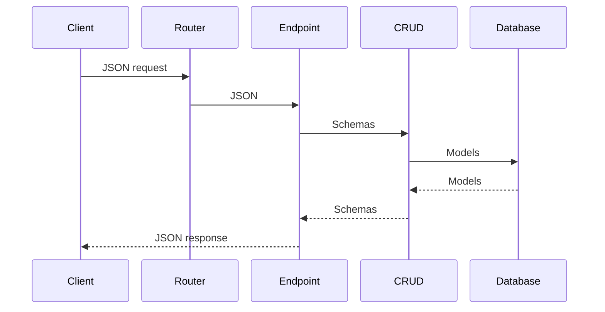

# Module architecture

## Introduction

In this section, we will explain the architecture of a module, and the different files that compose a module, and their purpose.

## Module structure

Files tree of a module:

```
app/modules/{module_name}/
├── __init__.py
├── cruds_{module_name}.py
├── endpoints_{module_name}.py
├── models_{module_name}.py
├── schemas_{module_name}.py
├── utils_{module_name}.py
```

## Lifecycle of an API request in a module

When an API request is made to an endpoint of a module, the following steps are executed:

1. The request is received by the router of the module, which is defined at the top of the `endpoints_{module_name}.py` file.
2. The router calls the corresponding endpoint function, which is defined in the same file.
3. The endpoint function may call some CRUD functions defined in the `cruds_{module_name}.py` file, to perform some operations on the database.
3.1 The CRUD functions use the models defined in the `models_{module_name}.py` file to interact with the database.
3.2 The CRUD functions also convert the database models to schemas defined in the `schemas_{module_name}.py` file, to return the data in the desired format when fetching data.
4. The endpoint function may also use some utility functions defined in the `utils_{module_name}.py` file, to perform some operations that are not related to the database.
5. Finally, the endpoint function returns a response to the client (A schema, None or an error).

**Visual representation** of the flow:

