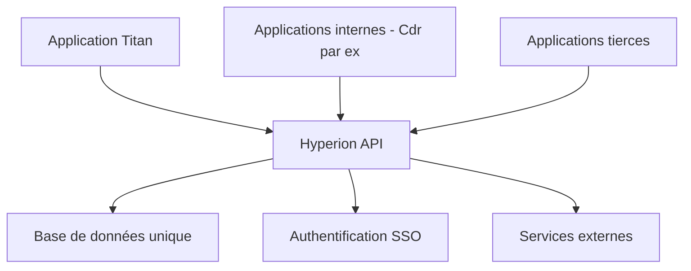
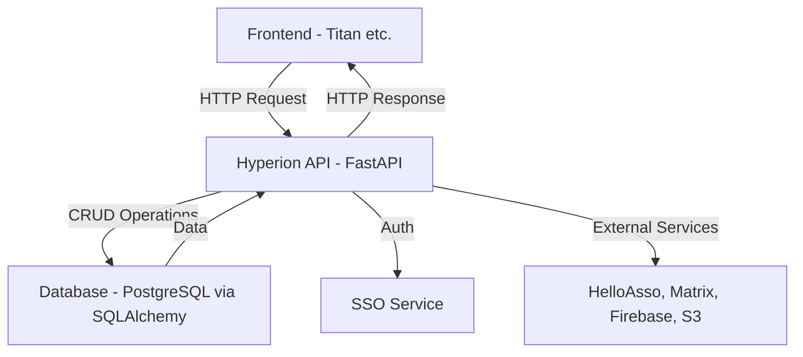

# Qu'est-ce qu'Hyperion et pourquoi en avons-nous besoin ?

## Introduction

Hyperion est le **back-end** de MyECL, l'application étudiante de l'École Centrale de Lyon. Si vous êtes nouveau dans le développement web, pensez au back-end comme au "cerveau" caché derrière une application : c'est lui qui gère les données, la logique métier, et fournit les informations au front-end (l'interface que voient les utilisateurs).

## Pourquoi Hyperion existe-t-il ?

### Le problème à résoudre

Avant Hyperion, les services numériques d'ECLAIR étaient éparpillés :

- Des sites web séparés pour différents services
- Des bases de données qui ne communiquaient pas entre elles
- Des systèmes d'authentification différents
- Une maintenance complexe
- Un MyECL d'aujourd'hui inexistant

### La solution : un back-end unifié

Hyperion centralise la plupart des services d'ECLAIR dès qu'il est question de gérer des les données d'étudiants :



## Que fait concrètement Hyperion ?

### Gestion des utilisateurs et groupes

- **Comptes étudiants** : Compte utilisateur unique pour tous les services
- **Groupes et associations** : Gestion des BDE, clubs, associations
- **Permissions** : Qui peut faire quoi selon son statut

### Services aux étudiants

- **Actualités et événements** : Diffusion d'informations
- **Réservations** : Salles, matériel, créneaux
- **Paiements** : Via MyECLPay pour les cotisations, événements
- **Cinéma** : Programmation et réservations
- Et beaucoup plus à venir grâce à vous !

### Services administratifs

- **Authentification unique (SSO)** : Un seul login pour tous les services
- **Gestion documentaire** : Stockage et partage de fichiers
- **Notifications** : Push mobile, emails, Matrix

## Architecture technique : pourquoi ces choix ?

### FastAPI comme framework web

```python
from fastapi import FastAPI

app = FastAPI()

@app.get("/users/me")
async def get_current_user():
    return {"username": "john_doe", "email": "john@ecl.ec-lyon.fr"}
```

**Pourquoi FastAPI ?**

- **Performance** : L'un des frameworks Python les plus rapides
- **Type safety** : Validation automatique des données
- **Documentation auto** : Génération de la doc API automatiquement
- **Async natif** : Gestion optimale de la concurrence

### PostgreSQL comme base de données

**Pourquoi PostgreSQL ?**

- **Robustesse** : Base de données enterprise-grade
- **Relations complexes** : Parfait pour modéliser les groupes, permissions, etc.
- **Performance** : Optimisé pour les applications web
- **JSON natif** : Flexibilité pour des données semi-structurées

### SQLAlchemy comme ORM

```python
class User(Base):
    __tablename__ = "users"

    id = Column(Integer, primary_key=True)
    username = Column(String(50), unique=True)
    email = Column(String(100))

    # Relations automatiques
    groups = relationship("Group", back_populates="members")
```

**Pourquoi SQLAlchemy ?**

- **Type safety** : Les erreurs sont détectées avant la production
- **Relations automatiques** : Plus besoin d'écrire les jointures à la main
- **Migrations** : Évolution du schéma de base simplifiée

## L'écosystème MyECL

Hyperion ne vit pas seul, il fait partie d'un écosystème :

### Applications clientes

- **MyECL Mobile App - Titan** (Flutter) : Application mobile et web officielle
- **Applications tierces** : Autres services qui utilisent l'API

### Services externes intégrés

- **HelloAsso** : Billetterie pour les événements
- **Matrix** : Système de messagerie intégré
- **Firebase** : Notifications push mobile
- **S3** : Stockage de fichiers (photos, documents)

## Exemple concret : la vie d'une requête

Imaginons qu'un étudiant veuille voir ses réservations de salle :

1. **Frontend** : L'app mobile fait une requête `GET /bookings/me`
2. **Authentification** : Hyperion vérifie que l'utilisateur est bien connecté
3. **Endpoint** : La fonction Python correspondante à la requête de l'utilisateur est appelée
4. **CRUD** : Requête SQL pour récupérer les réservations
5. **Validation** : Les données sont formatées selon le schéma Pydantic
6. **Réponse** : JSON envoyé au frontend

```python
@router.get("/bookings/me", response_model=List[BookingSchema])
async def get_my_bookings(
    current_user: User = Depends(get_current_user),
    db: AsyncSession = Depends(get_db)
):
    # La logique métier ici
    bookings = await crud_booking.get_user_bookings(db, current_user.id)
    return bookings
```

Exemple de réponse

```json
[
  {
    "id": 1,
    "room": "Salle A101",
    "date": "2024-09-10T14:00:00",
    "duration": 2
  },
  {
    "id": 2,
    "room": "Salle B202",
    "date": "2024-09-12T10:00:00",
    "duration": 1
  }
]
```

## Concepts clés à retenir

### API REST

Hyperion expose une **API REST** : un ensemble d'endpoints HTTP qui permettent aux applications clientes de :

- **Créer** des données (POST)
- **Lire** des données (GET)
- **Modifier** des données (PUT/PATCH)
- **Supprimer** des données (DELETE)

### Authentification et autorisation

- **Authentification** : "Qui êtes-vous ?" (login/password, token)
- **Autorisation** : "Qu'avez-vous le droit de faire ?" (permissions, rôles)

### Validation des données

Toutes les données qui entrent et sortent d'Hyperion sont validées :

- **Côté entrée** : Vérification que les données reçues sont correctes
- **Côté sortie** : Garantie que les données envoyées respectent le format attendu

### Le schéma à retenir



## Pourquoi apprendre Hyperion ?

### Pour votre formation

- **Architecture moderne** : Découverte des patterns actuels du web
- **Technologies populaires** : FastAPI, SQLAlchemy, PostgreSQL sont très demandés
- **Bonnes pratiques** : Code propre, tests, documentation

### Pour l'école

- **Impact réel** : Votre code sera utilisé par tous les étudiants de Centrale
- **Collaboration** : Travail en équipe sur un vrai projet
- **Responsabilité** : Maintien d'un service critique pour l'école

### Pour votre avenir professionnel

- **Expérience concrète** : Un vrai projet en production sur votre CV
- **Stack moderne** : Technologies utilisées dans l'industrie
- **Architecture scalable** : Patterns réutilisables dans d'autres projets

## Prochaines étapes

Maintenant que vous comprenez **pourquoi** Hyperion existe et **ce qu'il fait**, nous allons voir **comment** il fonctionne :

1. [Les 4 verbes fondamentaux](./les-4-verbes.md) - La base de toute API
2. [Configuration](./configuration.md) - Comment configurer Hyperion
3. [Premier lancement](./premier-lancement.md) - Mise en route pratique

::: tip Conseil
N'hésitez pas à poser des questions ! Les anciens de l'association sont là pour vous accompagner dans votre apprentissage.
:::
