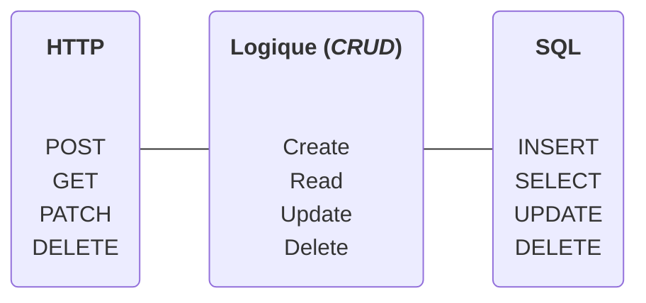
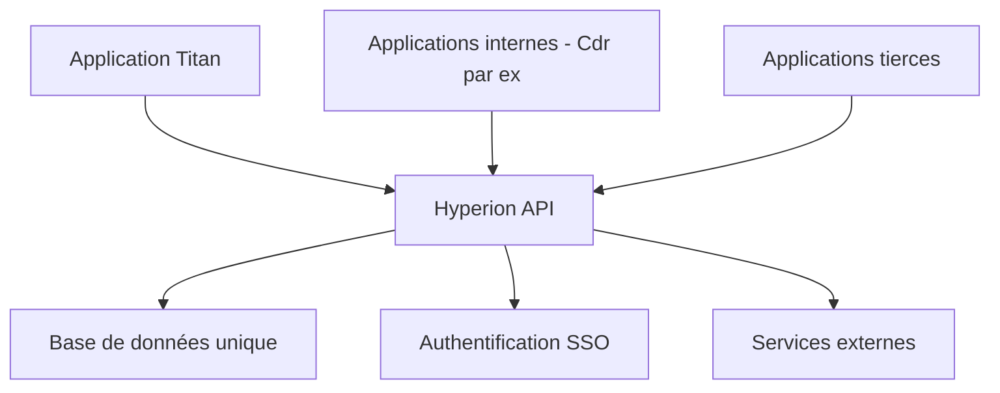
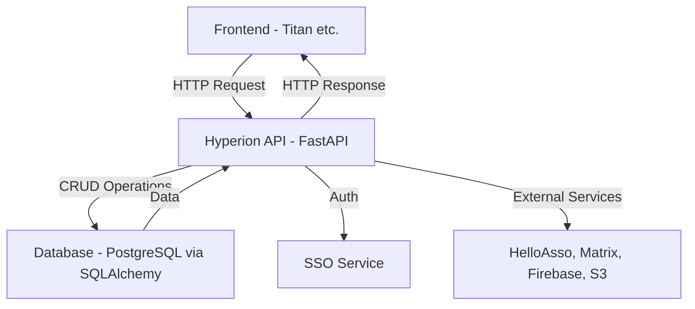

- Une page qui explique pourquoi on a besoin d'Hyperion en premier lieu et ce que c'est.
  - Expliquer la notion de front-end / back-end pour une application mobile


# Pourquoi Hyperion existe-t-il ?

# Quoi

Hyperion est le back-end de MyECL, l'application étudiante de l'École Centrale de Lyon. Si vous êtes nouveau dans le développement web, pensez au back-end comme au "cerveau" caché derrière une application : c'est lui qui gère les données, la logique métier, et fournit les informations au front-end (l'interface que voient les utilisateurs).



Bordel de Skyrol là-dessous

# Qu'est-ce qu'Hyperion et pourquoi en avons-nous besoin ?

## Introduction

Hyperion est le **back-end** de MyECL, l'application étudiante de l'École Centrale de Lyon. Si vous êtes nouveau dans le développement web, pensez au back-end comme au "cerveau" caché derrière une application : c'est lui qui gère les données, la logique métier, et fournit les informations au front-end (l'interface que voient les utilisateurs).

## Pourquoi Hyperion existe-t-il ?

### Le problème à résoudre

Avant Hyperion, les services numériques d'ECLAIR étaient éparpillés :

- Des sites web séparés pour différents services
- Des bases de données qui ne communiquaient pas entre elles
- Des systèmes d'authentification différents
- Une maintenance complexe
- Un MyECL d'aujourd'hui inexistant

### La solution : un back-end unifié

Hyperion centralise la plupart des services d'ECLAIR dès qu'il est question de gérer des les données d'étudiants :



## Que fait concrètement Hyperion ?

### Gestion des utilisateurs et groupes

- **Comptes étudiants** : Compte utilisateur unique pour tous les services
- **Groupes et associations** : Gestion des BDE, clubs, associations
- **Permissions** : Qui peut faire quoi selon son statut

### Services aux étudiants

- **Actualités et événements** : Diffusion d'informations
- **Réservations** : Salles, matériel, créneaux
- **Paiements** : Via MyECLPay pour les cotisations, événements
- **Cinéma** : Programmation et réservations
- Et beaucoup plus à venir grâce à vous !

### Services administratifs

- **Authentification unique (SSO)** : Un seul login pour tous les services
- **Gestion documentaire** : Stockage et partage de fichiers
- **Notifications** : Push mobile, emails, Matrix

## Architecture technique : pourquoi ces choix ?

### FastAPI comme framework web

```python
from fastapi import FastAPI

app = FastAPI()

@app.get("/users/me")
async def get_current_user():
    return {"username": "john_doe", "email": "john@ecl.ec-lyon.fr"}
```

**Pourquoi FastAPI ?**

- **Performance** : L'un des frameworks Python les plus rapides
- **Type safety** : Validation automatique des données
- **Documentation auto** : Génération de la doc API automatiquement
- **Async natif** : Gestion optimale de la concurrence

### PostgreSQL comme base de données

**Pourquoi PostgreSQL ?**

- **Robustesse** : Base de données enterprise-grade
- **Relations complexes** : Parfait pour modéliser les groupes, permissions, etc.
- **Performance** : Optimisé pour les applications web
- **JSON natif** : Flexibilité pour des données semi-structurées

### SQLAlchemy comme ORM

```python
class User(Base):
    __tablename__ = "users"

    id = Column(Integer, primary_key=True)
    username = Column(String(50), unique=True)
    email = Column(String(100))

    # Relations automatiques
    groups = relationship("Group", back_populates="members")
```

**Pourquoi SQLAlchemy ?**

- **Type safety** : Les erreurs sont détectées avant la production
- **Relations automatiques** : Plus besoin d'écrire les jointures à la main
- **Migrations** : Évolution du schéma de base simplifiée

## L'écosystème MyECL

Hyperion ne vit pas seul, il fait partie d'un écosystème :

### Applications clientes

- **MyECL Mobile App - Titan** (Flutter) : Application mobile et web officielle
- **Applications tierces** : Autres services qui utilisent l'API

### Services externes intégrés

- **HelloAsso** : Billetterie pour les événements
- **Matrix** : Système de messagerie intégré
- **Firebase** : Notifications push mobile
- **S3** : Stockage de fichiers (photos, documents)

## Exemple concret : la vie d'une requête

Imaginons qu'un étudiant veuille voir ses réservations de salle :

1. **Frontend** : L'app mobile fait une requête `GET /bookings/me`
2. **Authentification** : Hyperion vérifie que l'utilisateur est bien connecté
3. **Endpoint** : La fonction Python correspondante à la requête de l'utilisateur est appelée
4. **CRUD** : Requête SQL pour récupérer les réservations
5. **Validation** : Les données sont formatées selon le schéma Pydantic
6. **Réponse** : JSON envoyé au frontend

```python
@router.get("/bookings/me", response_model=List[BookingSchema])
async def get_my_bookings(
    current_user: User = Depends(get_current_user),
    db: AsyncSession = Depends(get_db)
):
    # La logique métier ici
    bookings = await crud_booking.get_user_bookings(db, current_user.id)
    return bookings
```

Exemple de réponse

```json
[
  {
    "id": 1,
    "room": "Salle A101",
    "date": "2024-09-10T14:00:00",
    "duration": 2
  },
  {
    "id": 2,
    "room": "Salle B202",
    "date": "2024-09-12T10:00:00",
    "duration": 1
  }
]
```

## Concepts clés à retenir

### API REST

Hyperion expose une **API REST** : un ensemble d'endpoints HTTP qui permettent aux applications clientes de :

- **Créer** des données (POST)
- **Lire** des données (GET)
- **Modifier** des données (PUT/PATCH)
- **Supprimer** des données (DELETE)

### Authentification et autorisation

- **Authentification** : "Qui êtes-vous ?" (login/password, token)
- **Autorisation** : "Qu'avez-vous le droit de faire ?" (permissions, rôles)

### Validation des données

Toutes les données qui entrent et sortent d'Hyperion sont validées :

- **Côté entrée** : Vérification que les données reçues sont correctes
- **Côté sortie** : Garantie que les données envoyées respectent le format attendu

### Le schéma à retenir



## Pourquoi apprendre Hyperion ?

### Pour votre formation

- **Architecture moderne** : Découverte des patterns actuels du web
- **Technologies populaires** : FastAPI, SQLAlchemy, PostgreSQL sont très demandés
- **Bonnes pratiques** : Code propre, tests, documentation

### Pour l'école

- **Impact réel** : Votre code sera utilisé par tous les étudiants de Centrale
- **Collaboration** : Travail en équipe sur un vrai projet
- **Responsabilité** : Maintien d'un service critique pour l'école

### Pour votre avenir professionnel

- **Expérience concrète** : Un vrai projet en production sur votre CV
- **Stack moderne** : Technologies utilisées dans l'industrie
- **Architecture scalable** : Patterns réutilisables dans d'autres projets

## Prochaines étapes

Maintenant que vous comprenez **pourquoi** Hyperion existe et **ce qu'il fait**, nous allons voir **comment** il fonctionne :

1. [Les 4 verbes fondamentaux](./les-4-verbes.md) - La base de toute API
2. [Configuration](./configuration.md) - Comment configurer Hyperion
3. [Premier lancement](./premier-lancement.md) - Mise en route pratique

::: tip

N'hésitez pas à poser des questions ! Les anciens de l'association sont là pour vous accompagner dans votre apprentissage.

:::

# Les 4 verbes fondamentaux

## Une architecture en miroir

L'une des beautés d'Hyperion, c'est que tout repose sur la même structure logique à trois niveaux. Ces **4 verbes** se retrouvent partout et facilitent énormément la compréhension du système.


## Les 4 verbes HTTP

### GET - Récupérer des données

Le verbe le plus simple : on demande des informations au serveur.

```http
GET /users/123
GET /events
GET /groups/bde/members
```

**Caractéristiques :**

- **Idempotent** : Peut être appelé plusieurs fois sans effet de bord
- **Sans corps** : Pas de données dans la requête
- **Cacheable** : Le navigateur peut mettre en cache la réponse

### POST - Créer des données

Pour créer de nouvelles ressources.

```http
POST /users
Content-Type: application/json

{
  "username": "nouveau_etudiant",
  "email": "nouveau@ecl.ec-lyon.fr"
}
```

**Caractéristiques :**

- **Non-idempotent** : Chaque appel crée une nouvelle ressource
- **Avec corps** : Les données à créer sont dans le body
- **Code 201** : "Created" en cas de succès

### PATCH - Modifier des données

Pour mettre à jour partiellement une ressource existante.

```http
PATCH /users/123
Content-Type: application/json

{
  "email": "nouvelle_adresse@ecl.ec-lyon.fr"
}
```

**Caractéristiques :**

- **Modification partielle** : On envoie seulement les champs à modifier
- **Idempotent** : Même résultat si appelé plusieurs fois
- **Code 200** : "OK" en cas de succès

### DELETE - Supprimer des données

Pour supprimer une ressource.

```http
DELETE /users/123
```

**Caractéristiques :**

- **Destructif** : La ressource n'existe plus après
- **Idempotent** : Supprimer une ressource déjà supprimée ne change rien
- **Code 204** : "No Content" en cas de succès

## Les 4 opérations CRUD

CRUD signifie **Create, Read, Update, Delete**. C'est la même logique que HTTP, mais du point de vue applicatif.

### Create - Créer

```python
# Dans un endpoint Hyperion
@router.post("/users", response_model=UserSchema)
async def create_user(
    user_data: UserCreateSchema,
    db: AsyncSession = Depends(get_db)
):
    # Appel du CRUD
    new_user = await crud_user.create(db, user_data)
    return new_user
```

### Read - Lire

```python
@router.get("/users/{user_id}", response_model=UserSchema)
async def get_user(
    user_id: int,
    db: AsyncSession = Depends(get_db)
):
    user = await crud_user.get(db, user_id)
    if not user:
        raise HTTPException(status_code=404, detail="User not found")
    return user
```

### Update - Mettre à jour

```python
@router.patch("/users/{user_id}", response_model=UserSchema)
async def update_user(
    user_id: int,
    user_updates: UserUpdateSchema,
    db: AsyncSession = Depends(get_db)
):
    updated_user = await crud_user.update(db, user_id, user_updates)
    return updated_user
```

### Delete - Supprimer

```python
@router.delete("/users/{user_id}")
async def delete_user(
    user_id: int,
    db: AsyncSession = Depends(get_db)
):
    await crud_user.delete(db, user_id)
    return {"message": "User deleted successfully"}
```

## Les 4 verbes SQL

Au final, toutes ces opérations se traduisent en requêtes SQL dans la base de données.

### INSERT - Créer

```sql
INSERT INTO users (username, email, created_at)
VALUES ('nouveau_etudiant', 'nouveau@ecl.ec-lyon.fr', NOW());
```

```python
# Équivalent SQLAlchemy
new_user = User(
    username="nouveau_etudiant",
    email="nouveau@ecl.ec-lyon.fr"
)
db.add(new_user)
await db.commit()
```

### SELECT - Lire

```sql
SELECT id, username, email FROM users WHERE id = 123;
SELECT * FROM events WHERE date >= '2024-01-01';
```

```python
# Équivalent SQLAlchemy
user = await db.execute(select(User).where(User.id == 123))
user = user.scalars().first()

events = await db.execute(select(Event).where(Event.date >= date(2024, 1, 1)))
events = events.scalars().all()
```

### UPDATE - Modifier

```sql
UPDATE users
SET email = 'nouvelle_adresse@ecl.ec-lyon.fr'
WHERE id = 123;
```

```python
# Équivalent SQLAlchemy
await db.execute(
    update(User)
    .where(User.id == 123)
    .values(email="nouvelle_adresse@ecl.ec-lyon.fr")
)
await db.commit()
```

### DELETE - Supprimer

```sql
DELETE FROM users WHERE id = 123;
```

```python
# Équivalent SQLAlchemy
await db.execute(delete(User).where(User.id == 123))
await db.commit()
```

## La correspondance parfaite

Voici comment ces trois niveaux se correspondent dans Hyperion :

| HTTP   | CRUD   | SQL    | Objectif                         |
| ------ | ------ | ------ | -------------------------------- |
| POST   | Create | INSERT | Créer une nouvelle ressource     |
| GET    | Read   | SELECT | Récupérer des données            |
| PATCH  | Update | UPDATE | Modifier une ressource existante |
| DELETE | Delete | DELETE | Supprimer une ressource          |

## Exemple complet : gestion d'un événement

Suivons la création d'un événement à travers les trois couches :

### 1. Requête HTTP du client

```http
POST /events
Authorization: Bearer jwt_token_here
Content-Type: application/json

{
  "title": "Soirée BDE",
  "description": "Grande soirée de rentrée",
  "date": "2024-09-15T20:00:00",
  "location": "Foyer"
}
```

### 2. Endpoint FastAPI (niveau CRUD)

```python
@router.post("/events", response_model=EventSchema)
async def create_event(
    event_data: EventCreateSchema,
    current_user: User = Depends(get_current_user),
    db: AsyncSession = Depends(get_db)
):
    # Vérifications métier
    if not current_user.can_create_events():
        raise HTTPException(status_code=403, detail="Insufficient permissions")

    # CRUD Create
    new_event = await crud_event.create(db, event_data)
    return new_event
```

### 3. CRUD vers SQL

```python
async def create(db: AsyncSession, event_data: EventCreateSchema) -> Event:
    # Conversion schema → model
    event = Event(
        title=event_data.title,
        description=event_data.description,
        date=event_data.date,
        location=event_data.location
    )

    # SQL INSERT via SQLAlchemy
    db.add(event)
    await db.commit()
    await db.refresh(event)  # Pour récupérer l'ID généré

    return event
```

## Codes de statut HTTP essentiels

### 2xx - Succès

- **200 OK** : Requête réussie (GET, PATCH)
- **201 Created** : Ressource créée avec succès (POST)
- **204 No Content** : Requête réussie sans contenu (DELETE)

### 4xx - Erreurs client

- **400 Bad Request** : Données malformées
- **401 Unauthorized** : Authentification requise
- **403 Forbidden** : Permissions insuffisantes
- **404 Not Found** : Ressource introuvable
- **422 Unprocessable Entity** : Validation échouée

### 5xx - Erreurs serveur

- **500 Internal Server Error** : Erreur interne du serveur

```python
# Dans Hyperion, on utilise HTTPException
from fastapi import HTTPException

# Ressource non trouvée
if not user:
    raise HTTPException(status_code=404, detail="User not found")

# Permissions insuffisantes
if not user.is_admin:
    raise HTTPException(status_code=403, detail="Admin access required")

# Données invalides (géré automatiquement par Pydantic)
# → Code 422 automatique si le schema n'est pas respecté
```

## Pourquoi cette cohérence est importante

### 1. Facilité d'apprentissage

Une fois que vous maîtrisez la logique des 4 verbes, vous pouvez :

- Comprendre n'importe quel endpoint d'Hyperion
- Créer de nouveaux endpoints facilement
- Déboguer plus efficacement

### 2. Maintenabilité

- **Structure prévisible** : Chaque développeur sait où chercher
- **Patterns réutilisables** : Moins de code à écrire
- **Tests simplifiés** : Même structure de test pour tous les endpoints

### 3. Performance

- **Correspondance directe** : Moins de transformations entre les couches
- **Optimisations SQL** : SQLAlchemy peut optimiser les requêtes
- **Cache efficace** : Les opérations GET peuvent être mises en cache

## Prochaines étapes

Maintenant que vous comprenez cette logique fondamentale, nous pouvons passer à :

1. [Configuration](./configuration.md) - Comment configurer Hyperion
2. [Premier lancement](./premier-lancement.md) - Mise en pratique

::: tip Astuce de développeur

Quand vous travaillez sur Hyperion, pensez toujours en termes de ces 4 verbes. Ça vous aidera à structurer votre code et à comprendre celui des autres !

:::

::: info Pour aller plus loin

Cette logique REST est un standard de l'industrie. Les compétences que vous développez avec Hyperion sont directement transférables à d'autres projets et frameworks.

:::
