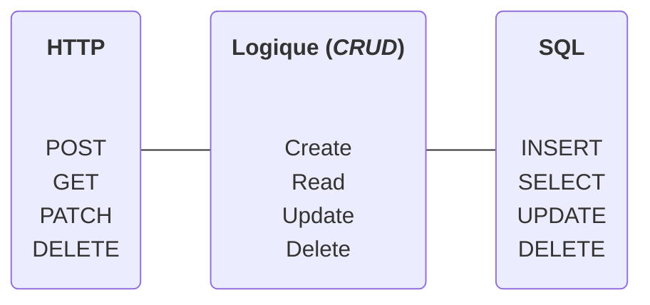

## CRUD

```mermaid
graph LR
    HTTP("`
        **HTTP**
        <br/>
        POST
        GET
        PATCH
        DELETE
    `")
    CRUD("`
        **Logique (*CRUD*)**
        <br/>
        Create
        Read
        Update
        Delete
    `")
    SQL("`
        **SQL**
        <br/>
        INSERT
        SELECT
        UPDATE
        DELETE
    `")
    HTTP --- CRUD --- SQL
```

::: warning

Faire plutôt un tableau qui met en correspondance les 3 avec une explication

:::
