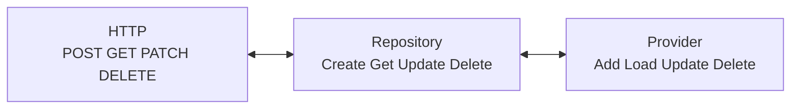

# Qu'est-ce que Titan et pourquoi en avons-nous besoin ?

## Introduction

Titan est le **front-end** de MyECL, l'application étudiante de l'École Centrale de Lyon. Si vous êtes nouveau dans le développement web ou applicatif, pensez au front-end comme au "visuel" d'une application : c'est lui qui affiche les données, les actions logique métier, et récupère les informations du back-end (la gestion des données).

## Pourquoi Titan existe-t-il ?

### Le problème à résoudre

Avant Titan, Eclair ne proposait pas d'application mobile, or les élèves se servent plus de leur téléphone que de leur ordinateur

## Que fait concrètement Titan ?

Etant un des client d'Hyperion, il permet de visualiser et d'agir sur les données d'Hyperion.

### Gestion des utilisateurs et groupes

- **Comptes étudiants** : Compte utilisateur unique pour tous les services
- **Groupes et associations** : Gestion des BDE, clubs, associations
- **Permissions** : Qui peut faire quoi selon son statut

### Services aux étudiants

- **Actualités et événements** : Diffusion d'informations
- **Réservations** : Salles, matériel, créneaux
- **Paiements** : Via MyECLPay pour les cotisations, événements
- **Cinéma** : Programmation et réservations
- Et beaucoup plus à venir grâce à vous !

## Architecture technique : pourquoi ces choix ?

### Flutter comme framework multiplateforme

**Pourquoi Flutter ?**

- **Multiplateforme** : L'un des seul framework pouvant être porté partout, donc une seul codebase
- **De nombreuse libraires** : Evites de tout recoder en partant de zéro
- **Maintenue par Google** : Pas déprécié, sans cesse amélioré
- **Async natif** : Gestion optimale de la concurrence

### Riverpod comme state manager

::: info Qu'est ce qu'un state manager
Un state manager permet de mettre à jour le visuel en fonction des données, par exemple un loader en attendant qu'Hyperion réponde, puis les données récupérées ou une erreur.
:::

**Pourquoi Riverpod ?**

- **Stancard de l'industrie** : Fiable, utilisé par tous
- **Moins de boilerplate** : Un composant utilisant Riverpod s'écrit avec moins de code qui serait obligatoire sans

## L'écosystème MyECL

Titan ne vit pas seul, il fait partie d'un écosystème :

### Applications clientes

- **Hyperion** (Python) : Le back-end unique
- **Applications tierces** : Autres services qui utilisent l'API

## Exemple concret : la vie d'une requête

Imaginons qu'un étudiant veuille voir ses réservations de salle sur l'application

1. **Frontend** : L'app mobile fait une requête `GET /bookings/me`
2. **Réponse** : Hyperion répond après avoir fait ses opérations au frontend
3. **Repository** : Le repository récupère et transforme les données en objet Booking
4. **Provider** : Le provider se met à jour avec les nouvelles donnée
5. **UI** : La couche visuelle "regarde" le provider et se met à jour quand sa valeur change

```flutter
Future<List<Booking>> getUserBookingList() async {
    return List<Booking>.from(
        (await getList(suffix: "/bookings/me")).map((x) => Booking.fromJson(x)),
    );
}
```

Le repository, qui fait la requête et transforme la réponse en object Booking

```flutter
Future<AsyncValue<List<Booking>>> loadUserBookings() async {
    return await loadList(bookingRepository.getUserBookingList);
}

...

await provider.loadUserBookings();
```

Le provider, qui récupère les données du repository, et qui met à jour son état interne.
Dans le cas d'ajout, de modification ou de suppression, le state se met aussi à jour automatiquement avec les changements

```flutter
final bookings = ref.watch(userBookingListProvider);
```

Côté visuel, on regarde la valeur interne du provider, et dès qu'elle change, on reconstruit

::: info
Les fonctions présenté ici ne font pas tout, ce sont les fonctions comme `getList`, `loadList` qui se charge de gérer les conversions de données, les erreurs et la mise à jour des états internes, il faut donc les utiliser.
:::

## Concepts clés à retenir

### Application

Titan utilise une **API REST** : un ensemble d'endpoints HTTP qui permettent d'intéragir avec Hyperion pour :

- **Créer** des données (POST)
- **Lire** des données (GET)
- **Modifier** des données (PUT/PATCH)
- **Supprimer** des données (DELETE)

### State manager

- **Garder**: les données récupérées d'Hyperion
- **Mettre à jour** : automatiquement le visuel

## Pourquoi apprendre Titan ?

### Pour votre formation

- **Architecture moderne** : Découverte des patterns actuels du web et mobile
- **Technologies populaires** : Flutter, Riverpod sont des standards de l'industrie
- **Bonnes pratiques** : Code propre, tests, documentation

### Pour l'école

- **Impact réel** : Votre code sera utilisé par tous les étudiants de Centrale
- **Collaboration** : Travail en équipe sur un vrai projet
- **Responsabilité** : Maintien d'un service critique pour l'école

### Pour votre avenir professionnel

- **Expérience concrète** : Un vrai projet en production sur votre CV
- **Stack moderne** : Technologies utilisées dans l'industrie
- **Architecture scalable** : Patterns réutilisables dans d'autres projets

## Prochaines étapes

Maintenant que vous comprenez **pourquoi** Hyperion existe et **ce qu'il fait**, nous allons voir **comment** il fonctionne :

1. [Les 4 verbes fondamentaux](./les-4-verbes.md) - La base de toute API
2. [Configuration](./configuration.md) - Comment configurer Hyperion
3. [Premier lancement](./premier-lancement.md) - Mise en route pratique

::: tip

N'hésitez pas à poser des questions ! Les anciens de l'association sont là pour vous accompagner dans votre apprentissage.

:::

# Les 4 verbes fondamentaux

## Une architecture en miroir

L'une des beautés de Titan, c'est que tout repose sur la même structure logique à trois niveaux. Ces **4 verbes** se retrouvent partout et facilitent énormément la compréhension du système, comme pour Hyperion



## Les 4 verbes HTTP

### GET - Récupérer des données

Le verbe le plus simple : on demande des informations au serveur.

```http
GET /users/123
GET /events
GET /groups/bde/members
```

**Caractéristiques :**

- **Idempotent** : Peut être appelé plusieurs fois sans effet de bord
- **Sans corps** : Pas de données dans la requête
- **Cacheable** : Le navigateur peut mettre en cache la réponse

### POST - Créer des données

Pour créer de nouvelles ressources.

```http
POST /users
Content-Type: application/json

{
  "username": "nouveau_etudiant",
  "email": "nouveau@ecl.ec-lyon.fr"
}
```

**Caractéristiques :**

- **Non-idempotent** : Chaque appel crée une nouvelle ressource
- **Avec corps** : Les données à créer sont dans le body
- **Code 201** : "Created" en cas de succès

### PATCH - Modifier des données

Pour mettre à jour partiellement une ressource existante.

```http
PATCH /users/123
Content-Type: application/json

{
  "email": "nouvelle_adresse@ecl.ec-lyon.fr"
}
```

**Caractéristiques :**

- **Modification partielle** : On envoie seulement les champs à modifier
- **Idempotent** : Même résultat si appelé plusieurs fois
- **Code 200** : "OK" en cas de succès

### DELETE - Supprimer des données

Pour supprimer une ressource.

```http
DELETE /users/123
```

**Caractéristiques :**

- **Destructif** : La ressource n'existe plus après
- **Idempotent** : Supprimer une ressource déjà supprimée ne change rien
- **Code 204** : "No Content" en cas de succès

## Les opérations Repository

Un repository est un fichier qui s'occupe de toutes les interactions liés à un route API, ex /bookings.

```flutter
  Future<List<Booking>> getUserBookingList() async {
    return List<Booking>.from(
      (await getList(suffix: "/users/me")).map((x) => Booking.fromJson(x)),
    );
  }
```

Récupère une liste en json et la convertie en liste d'objet Booking

```flutter
  Future<Booking> createBooking(Booking booking) async {
    return Booking.fromJson(await create(booking.toJson()));
  }
```

Demande au back de créer un booking et le retourne une fois créé (donc avec son id)

```flutter
  Future<bool> updateBooking(Booking booking) async {
    return await update(booking.toJson(), "/${booking.id}");
  }
```

Demande au back de modifier un booking et le retourne une fois modifié

```flutter
  Future<bool> deleteBooking(String bookingId) async {
    return await delete("/$bookingId");
  }
```

Demande au back de supprimer un booking et retourne un booléen

::: info opérations get()
Dans le cas où ne veux récupérer qu'une seule donnée (donc pas une liste), on utilise get au lieu de getList
:::

::: info paramètres suffix
Certaines requête ont un path avec plus de paramètre, que l'on peut préciser avec le suffixe
:::

## Les opération Provider

```flutter
Future<AsyncValue<List<Booking>>> loadUserBookings() async {
    return await loadList(bookingRepository.getUserBookingList);
  }
```

Charge la liste via le repository

```flutter
  Future<bool> addBooking(Booking booking) async {
    return await add(bookingRepository.createBooking, booking);
  }
```

Demande au repository de créer un booking basé sur le booking donné en paramètre

```flutter
  Future<bool> updateBooking(Booking booking) async {
    return await update(
      bookingRepository.updateBooking,
      (bookings, booking) =>
          bookings..[bookings.indexWhere((b) => b.id == booking.id)] = booking,
      booking,
    );
  }
```

Demande au repository de modifier un booking basé sur le booking donné en paramètre et met à jour dans la liste de l'état interne

```flutter
  Future<bool> deleteBooking(Booking booking) async {
    return await delete(
      bookingRepository.deleteBooking,
      (bookings, booking) => bookings..removeWhere((i) => i.id == booking.id),
      booking.id,
      booking,
    );
  }
```

Demande au repository de supprimer un booking basé sur le booking donné en paramètre et met à jour dans la liste de l'état interne

::: info opérations load()
Dans le cas où ne veux récupérer qu'une seule donnée (donc pas une liste), on utilise load au lieu de loadList
:::

## La correspondance parfaite

Voici comment ces trois niveaux se correspondent dans Hyperion :

| HTTP   | Repository | Provider | Objectif                         |
| ------ | ---------- | -------- | -------------------------------- |
| POST   | Create     | Add      | Créer une nouvelle ressource     |
| GET    | Get        | Load     | Récupérer des données            |
| PATCH  | Update     | UPDATE   | Modifier une ressource existante |
| DELETE | Delete     | DELETE   | Supprimer une ressource          |

## Codes de statut HTTP essentiels

### 2xx - Succès

- **200 OK** : Requête réussie (GET, PATCH)
- **201 Created** : Ressource créée avec succès (POST)
- **204 No Content** : Requête réussie sans contenu (DELETE)

### 4xx - Erreurs client

- **400 Bad Request** : Données malformées
- **401 Unauthorized** : Authentification requise
- **403 Forbidden** : Permissions insuffisantes
- **404 Not Found** : Ressource introuvable
- **422 Unprocessable Entity** : Validation échouée

### 5xx - Erreurs serveur

- **500 Internal Server Error** : Erreur interne du serveur

Les erreurs sont gérées par les fonctions du repository, qui s'occupe de les logger.
Le provider peut prendre un état erreur, pour que le visuel puisse afficher le message d'erreur.
